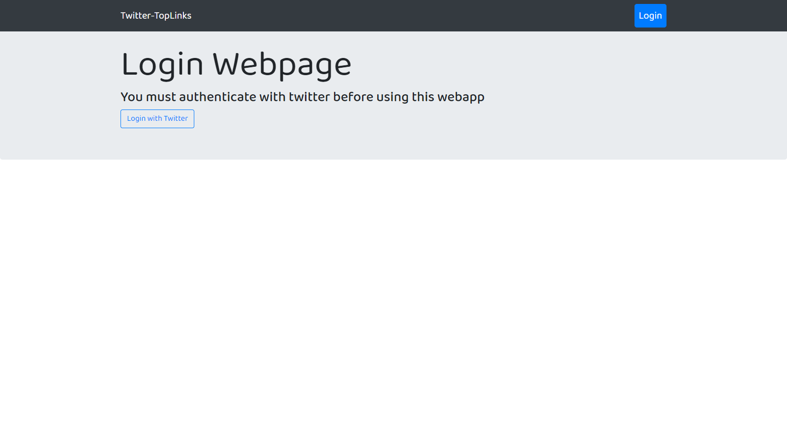
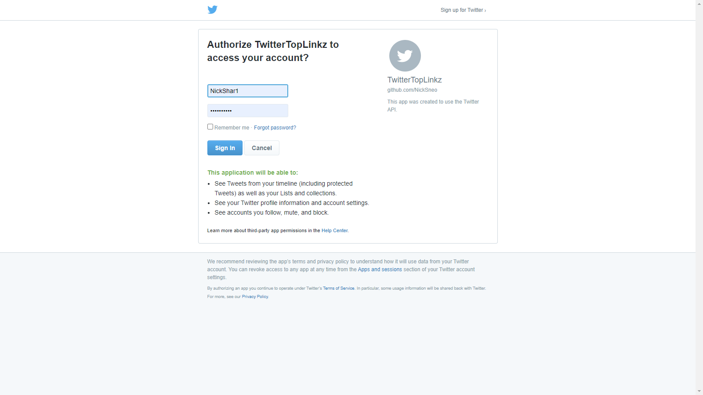
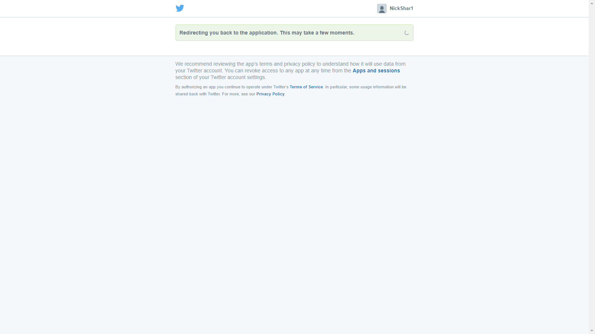
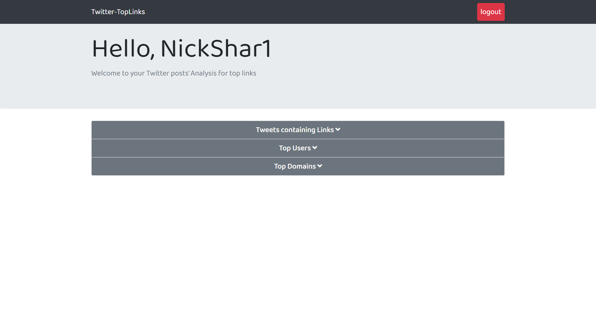
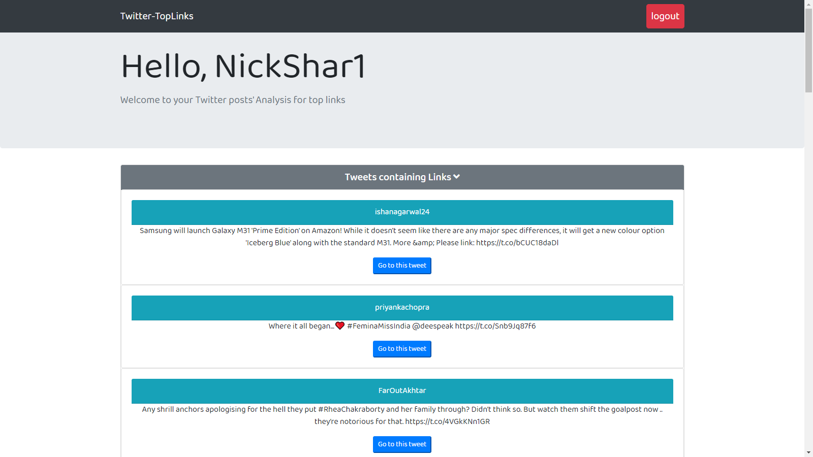
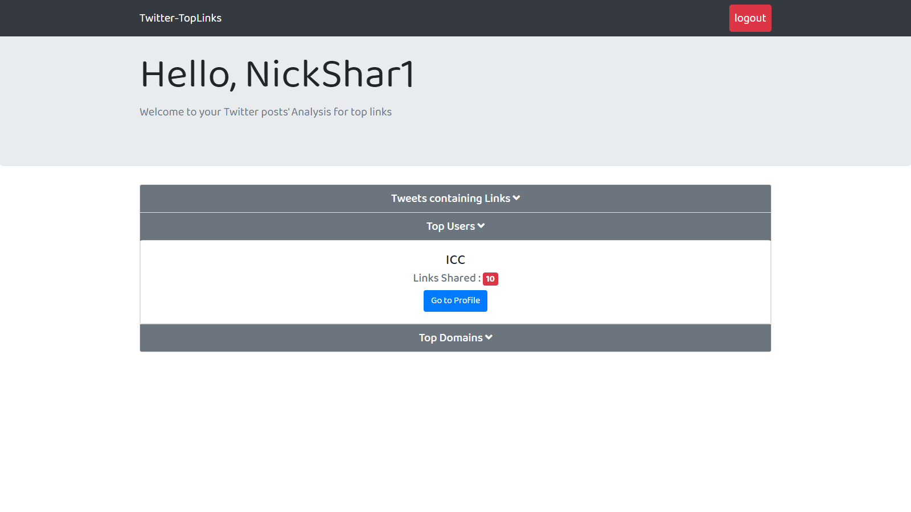
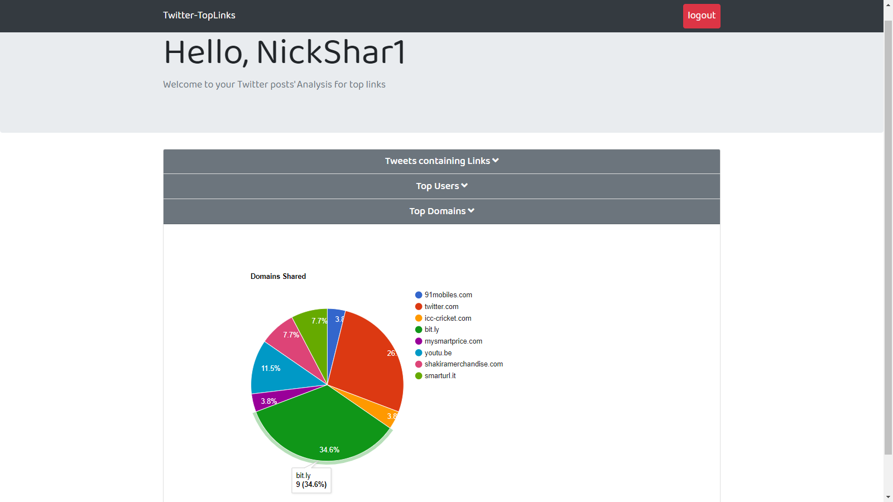

# TWITTER-TOPLINKS WEB APPLICATION

This webapp fulfills the following functionalities.

- Let the user login(Aunthenticate) with Twitter.
- After authenticating, fetch tweets containing urls from user's timeline (friends + user's tweets) from past 7 days and displays them.
- Display most shared domains from user's timeline.
- Display top users that have shared most links.

## Extra Features

- Direct button to go to the original tweet/post
- Direct button to go to the Top User's Profile
- Beautiful Pie Chart for Top Domains
- Clean and clutter free UI

## Deployment

- This webapp is deployed on Heroku, Link is [here](https://twittertoplinks.herokuapp.com/).

## Table of Contents

1. [Pre-Requisites](#Pre-Requisites)
2. [Setup and Installation](#Installation)
3. [Starting the Project](#Starting-the-project)
4. [Tech Stack Used](#tech-stack-used)
5. [Features and Implementation](#Features-and-Implementation)
6. [Working with the app](#Working-with-the-app)
7. [Working Demo](#Working-Demo)
8. [Contact Me](#contact-me)

## Pre-Requisites

- Django Framework should be installed on your system
- Python v3.8 should be installed on your system
- PIP Packages should be installed on your system
- Developer account on Twitter for Secret Keys

## Installation

To run the app locally follow the below steps :

- Clone the repository.

```
git clone https://github.com/NickSneo/TwitterTopLinks.git
```

- Run the following command -

```
pip install -r requirements.txt
```

- Make `migrations` to the database.

```
python3 manage.py makemigrations
python3 manage.py migrate
```

- In TwitterTopLinks(root) folder create a new `.env` file using following command -

```
cd TwitterTopLinks/
touch .env
```

- To Generate a `secret key` for django app, Go to this website [here](https://djecrety.ir/)

- Click on Generate Button
- And Copy this Generated Secret Key
- Paste this Key in `SECRET_KEY` in `.env` file.
- Also get `CONSUMER_KEY` AND `CONSUMER_SECRET` using Twitter Developer Account from [here](https://developer.twitter.com/en) and store in `.env` file
- Finally `.env` file will look like -

```
SOCIAL_AUTH_TWITTER_KEY=Your_Consumer_Key_Without_Space_and_Qoutes
SOCIAL_AUTH_TWITTER_SECRET=Your_Consumer_Secret_Without_Space_and_Qoutes
SECRET_KEY=Your_Secret_Key_Without_Space_and_Qoutes
```

## Starting the Project

- Start the project using -

```
python3 manage.py runserver
```

- Browse to http://127.0.0.1:8000/ to see your web app.

## Tech Stack Used

**Frontend**

- HTML
- CSS
- JavaScript
- Bootstrap

**Backend**

- Django
- Python 3.8

**Database**

- SqLite3

**APIs and Libraries**

- Twitter API - For getting secret keys
- Social_Django - Backened for authenticating with Twitter
- Tweepy - Python library for accessing the Twitter API
- tld - top level domain (python library for extracting domain name)
- Google's Chart API - to create Pie Chart

## Features and Implementation

- After starting the server, the landing page will ask you to `Login Through Twitter`
- You wont be able to aceess anything before login on this `Login Page`
- After clicking on `Login with Twitter` button, you will be `redirected to Twitter's login page` to authenticate your account.
- After successful `authentication` you will taken to the `home page`
- On the `Home page` you will see all the analysis of your account
- The analysis include `extracting you home timeline's tweets from last 7 days` and then displaying only the tweets that contain Links.
- In the backgroud, `Tweepy` is used to extract your home timeline's tweets
- `Tweets containing links` are then stored in `Tweets Database` implemented using sqlite3
- Also all the shared `urls/links` are stored in `urls database`.
- After storing user's data in database, we extract this data to `calculate the top users and domains`
- On the home page you will also get the functionality to go to the `original tweet link on twitter` using `go to tweet button`
- You can also go to `top user's profile on twitter` using `go to profile button `
- A `beautiful pie chart` shows all the information about `top domains shared with their frequency`
- By Clicking on `logout` button, user can logout his account.
- After logging out, user will be `redirected to login page`
- Data Structures used - `Dictionary` for frequnecy and top user and top domain calculation, `List` for storing the tweets and users.

## Working with the app

**Login Page**

- Clicking on Login with Twitter Button will take you to Twitter's Authorization Page.
  
  > Login Page

**Twitter's Login Page**


> Twitter's Login Page

**Twitter's Authorization**


> Authorization

**Home Page**

- Home Page containg three dropdown card - Tweets containg links, Top Users, and Top Domains
  

  > Home Page View

- Expanded `Tweets` dropdown card containing tweeted user's screen name, tweet's text and go to tweet button



> Expanded Tweets

- Expanded `Top User` dropdown card, conatining screen name of user and go to profile button



> Expanded Top User

- Expanded `Top Domains` dropdown card, `beautiful pie chart` showing all the domains with thier frequency and percentage of all the domains.



> Expanded Top Domain

## Working Demo

- Full Working Demo of the Project


## Contact Me

You can contact me at <17ucc040@lnmiit.ac.in> or <nischal.1106@gmail.com>
